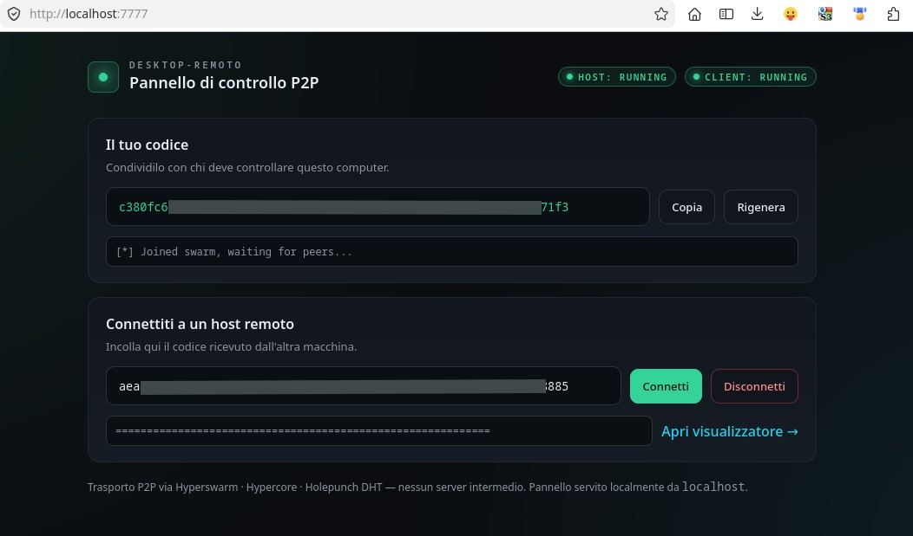
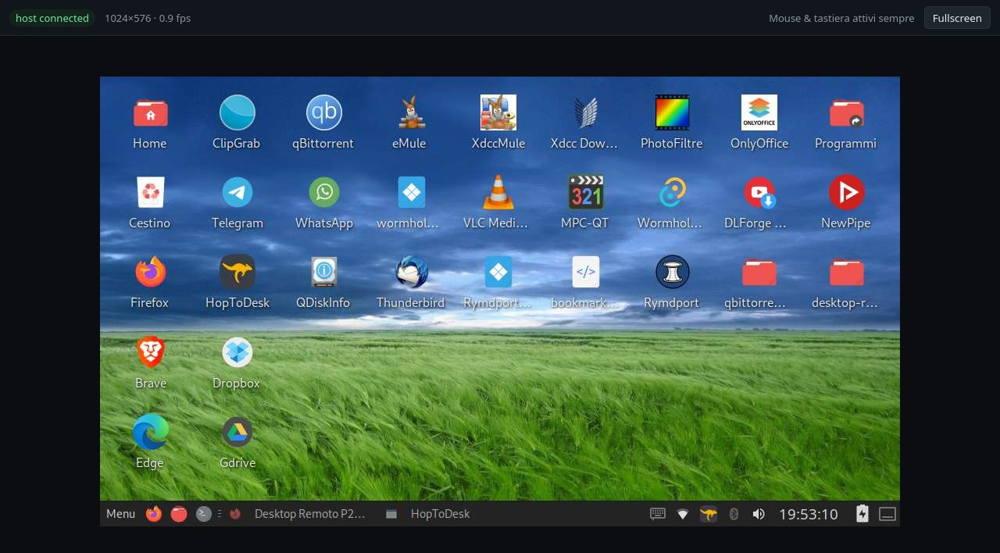

<table>
<tr>
<td width="180">
  
</td>
<td>
  
# PearDesk  
Remote Desktop Peer‑to‑Peer, leggero, veloce e senza server.

PearDesk è un sistema di desktop remoto completamente peer‑to‑peer, senza server centrali, senza cloud e senza dipendenze esterne.  
Connessione diretta, crittografata, multipiattaforma e ultra‑leggera.

</td>
</tr>
</table>

---

## 🚀 Caratteristiche principali

- 🔗 **Connessione P2P pura** (Holepunch / Hyperswarm)
- 🖥️ **Controllo remoto completo** (mouse + tastiera)
- ⚡ **Streaming schermo ad alta efficienza** (JPEG/WebP)
- 🔐 **Crittografia end‑to‑end** (Noise Protocol)
- 🌍 **NAT traversal automatico**
- 🧩 **Multipiattaforma** Linux, Windows. (macOS non ancora supportato)
- 🪶 **Zero server, zero cloud, zero dipendenze esterne**
- 🛠️ **Launcher automatico** (host + client + browser)

---

## 📸 Demo del funzionamento

### 🔹 1. Pannello di controllo P2P
Interfaccia locale che mostra:
- i miei codici P2P (locale + remoto) parzialmente oscurati
- stato di host e client
- connessione alla swarm
- pulsante per aprire il visualizzatore

---

### 🔹 2. Desktop remoto visualizzato dal client
Esempio reale di sessione remota con:
- risoluzione adattata
- FPS in tempo reale
- controllo mouse e tastiera attivi

---

## 📦 Struttura del progetto

desktop-host/  
→ Cattura schermo, input remoto, streaming P2P

desktop-client/  
→ Viewer web + input + connessione

launcher/  
→ Script di avvio automatico (host + client + browser)

---

## 🔧 Installazione

### 1. Clona la repo
git clone https://github.com/angelo978/PearDesk

### 2. Installa le dipendenze
Per ogni modulo:

cd ../desktop-host
npm install

cd ../desktop-client
npm install

cd ../launcher
npm install

---
## 🐧 Nota importante per Linux (schermo nero)

PearDesk utilizza un modulo di cattura schermo che richiede ImageMagick.

Se l’Host mostra uno schermo nero, installa:

sudo apt install imagemagick

Dopo l’installazione, riavvia PearDesk Host.

---

## 🔒 Sicurezza

- Connessione P2P diretta tramite Hyperswarm (senza server intermedi).

---

## 📜 Licenza

PearDesk è distribuito sotto **GPLv3 con restrizione aggiuntiva Non Commercial**.  
Consulta il file `LICENSE` per i dettagli.

---
## ⚠️ Stato del progetto

PearDesk è un prototipo funzionante e stabile nelle sue funzioni principali
(connessione P2P, streaming schermo, mouse, avvio automatico).

Alcune funzionalità possono essere migliorate o estese da chi desidera
contribuire, come:
- ottimizzazioni della tastiera su alcuni sistemi
- funzioni aggiuntive per l’invio/ricezione file
- miglioramenti dell’interfaccia

## ⭐ Contribuire
Il progetto è aperto a contributi della community.

---
## 📬 Contatti

Per richieste commerciali o permessi speciali, utilizza la Issue dedicata:  
👉 https://github.com/angelo978/PearDesk/issues/1

